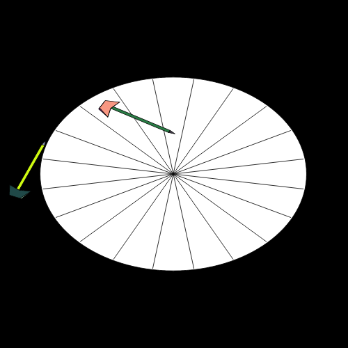

# Dartboard Generator

This project is a Dartboard Generator script that creates dartboards with random dart positions and scores. The script can generate multiple dartboards and save them as images. Generate 15k images in +-10minutes.

## Installation

To use this script, you need to have Node.js installed on your system. If you haven't already installed Node.js, you can download it from [nodejs.org](https://nodejs.org/).

1. Clone this repository to your local machine:

    ```bash
    git clone https://github.com/wouteropsommer/dartboard-generator-svg.git
    ```

2. Navigate to the project directory:

    ```bash
    cd dartboard-generator
    ```

3. Install the required dependencies:

    ```bash
    npm install
    ```

## Usage

To generate dartboards and save them as images, you can run the following command:

```bash
node generateDartboards.js
```

The script will generate 5k dartboards by default and save them in the `output_images` directory. You can modify the script to generate a different number of dartboards if needed.

## Example Output

Here are some example dartboards generated by the script:

<table>
  <tr>
    <td></td>
    <td></td>
  </tr>
  <tr>
    <td></td>
    <td></td>
  </tr>
</table>

## License

This project is licensed under the MIT License. See the [LICENSE](LICENSE) file for details.
